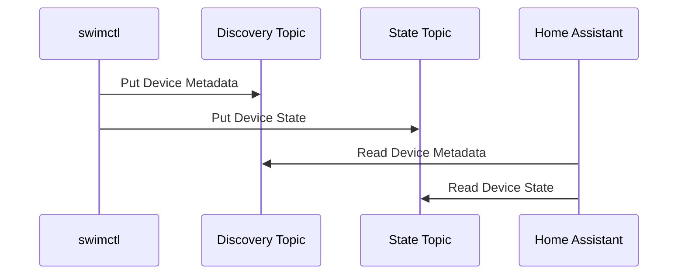

{class="post-banner"}

When I became a new pool owner, I was quickly frustrated by the cost and lack
of availability of parts for its aging pool automation system. After educating
myself about how everything worked, I decided to do something about it. Now
that it's feature complete, I wanted to share what I've built and talk  a bit
about how I got here.

<!-- more -->

## Goals

* Use Off-the-Shelf Parts

  This whole journey started because of badly behaved companies who have a
  stranglehold on the pool supply market, so the most important requirement was
  to build the entire system using readily available components. I wanted to
  ensure that any part of the system could be easily replaced without jumping
  through hoops or dealing with proprietary restrictions. This makes
  maintenance straightforward and encourages future experimentation and
  improvements.

* Feature Parity with the Old System

  The original automation system had the following features that I needed to
  implement:

    * Control the pool and spa lights
    * Handle switching from pool mode to spa mode by triggering valve actuators
    * Enable the heater to be turned on remotely
    * Ensure that the pump is running during spa operation
    * Run the blower when the spa is on

* Speed Control for the New Pump

  In addition to the original features, I wanted the new system to control the
  speed of the variable speed pump I'd purchased to replace the old rusty
  single-speed pump that came with the house. Most importantly, ramping the
  speed up when in spa mode, but also avoiding the need to reset the time on
  the pump's drive unit every time the power was interrupted.

* Multi-Mode Control of the Heater

  While the old system was capable of turning the heater on and off, it wasn't
  able to select between pool and spa temperatures. The new system will use a
  so-called 3-wire control (and eventually RS-485 if I can get it working) to
  enable choosing from one of two preset temperatures depending on use. 


## Major Hardware Components

* Compute

  For the brain of the operation, I chose a Raspberry Pi (I'm sure you're
  shocked). Its ubiquity in IoT and automation applications made it an obvious
  choice. It's inexpensive, widely supported, and comes with the necessary
  connectivity options like I²C and GPIO, making it well-suited for controlling
  and gathering data from external components.

  I originally considered an Arduino, or other microcontroller, but the
  availability of software like Node-RED pushed me to use a full single board
  computer. I'm thankful that I made this choice, because it's been a lot of
  work getting to where I am _without_ having to write the amount of custom
  code that a microcontroller would have required.

  Looking down the road, the one-to-one compatibility with Pi compute modules
  means I can take advantage of the industry's enthusiasm for that platform.
  There are already [many solutions](https://pipci.jeffgeerling.com/boards_cm)
  out there which use the CM4 for compute. I imagine a future iteration may end
  up using something akin to the [Techbase ModBerry 500
  CM4](https://modberry.techbase.eu/compute-module-4/), though I'd prefer a
  bit slimmer form factor.

  The overall flexibility of the Pi ecosystem allows for taking projects from
  initial prototyping to a fully productionalized solution, all while using the
  same platform.

* Computer-Controlled Relays

  Relays are what tie the software to the real world. I looked around at many
  different solutions and eventually stumbled upon Sequent Microsystems' [Eight
  Relays 4A/120V 8-Layer Stackable
  HAT](https://sequentmicrosystems.com/products/8-relays-stackable-card-for-raspberry-pi).
  Up to eight of these can be stacked onto a single Pi, and using two of them
  gave me a total of 16 SPDT relays and a bonus RS-485/MODBUS port. They
  integrate seamlessly with the Raspberry Pi, via I²C which leaves all of the
  GPIO pins open, and they have pre-built nodes for Node-RED, plus among a
  number of other integrations. All told, they've proved an efficient choice
  for managing multiple devices with very little effort.

* External Relays and other 24VAC components

  The pool and spa lights run too close to the 4 amp rating of the relays on
  the Sequent Microsystems board, so I added some extra Schneider Electric
  relays to control them. Similarly, the blower runs on 240v with a rating of
  1.5HP, so I added a large 2HP rated DPST relay to operate it.

  The actuators for the valves run on 24VAC, requiring that I add a transformer
  to the mix, so I chose to use this voltage to power the relay coils. 24VAC is
  pretty ubiquitous in the industrial automation space, so having this
  available helped with sourcing parts.

  <!-- TODO: wording; add link to transformer -->
  Finding the right transformer for these components was a bit of a challenge.
  It took me some time to choose one. I landed on the [TR100VA001 100Va, 120 to
  24 VAC transformer from Functional
  Devices](https://www.amazon.com/gp/product/B007IAVJ64/ref=ppx_yo_dt_b_search_asin_title?ie=UTF8&psc=1).
  I'm still not entirely sure I made the best choice, but it works for now. I
  think I might eventually be able to switch it out for a smaller unit without
  losing any functionality, but more math is required.

* Enclosure

  For the enclosure, I opted for an [IP67 Plastic Enclosure from
  Gratury](https://www.amazon.com/gp/product/B0BFPW79LS/ref=ppx_yo_dt_b_search_asin_title?ie=UTF8&psc=1)
  purchased on Amazon. This enclosure features a removable backplate with a
  grid of pre-formed holes, making it easy to mount components securely. The
  IP67 rating, plus some waterproof cable glands ensure that the system is
  well-protected from the elements. I opted for the 20″ × 16.1″ × 7.9″ box,
  which fit quite nicely in the space left by the old system.


* Circuit Protection

  The automation system functions, partially, as a load center for the
  pool equipment, so each major section of the panel has dedicated circuit
  breakers. This not only allows for the use of smaller gauge (less expensive
  and more flexible) wire but also enables isolation for troubleshooting
  purposes. By being able to cut power to specific sections, I can work on the
  system more safely and efficiently.

* Terminal blocks

  With this many components all being wired together, it's important to have an
  organized and space-efficient way to make all of the connections. Thankfully,
  [this is a solved problem](https://www.realpars.com/blog/terminal-blocks).
  Companies like [Wago](https://www.wago.com/us/discover-terminal-blocks),
  [Phoenix
  Contact](https://www.phoenixcontact.com/en-us/products/terminal-blocks) and
  [Dinkle](https://www.dinkle.com/en/home) have developed some amazing systems
  around din-mount terminal blocks. Pretty much any kind of connectivity or
  distribution you need can be made way easier, and more space-efficient, with
  these little molded plastic beauties.

  Early into sourcing parts for the project, I found the [Dinkle DK2.5N
  series](https://www.amazon.com/Color-DIN-Rail-Block-Kit/dp/B07NVV28D9)
  terminal blocks, sold by [International
  Connector](https://www.amazon.com/stores/InternationalConnector/page/121D90B6-FAA3-4F06-8AFA-66D5F4DDF93C)
  on Amazon. They were the easiest things to get my hands on at the time,
  and the kit comes with everything one needs to get started wiring things up,
  which gave me a nice boost.

  In the future, I'd like to go for some more premium components, now that I
  have a better idea of what's available and how things need to be laid out in
  the panel. I could save a ton of space on the bottom rail of the panel with
  some two or three level blocks, but I'll save that for a rainy day.

  If you're interested in building a panel and don't know where to start, Wago
  has a great selection of [free
  samples](https://www.wago.com/global/sample-service), so you can see what
  they have to offer without having to commit to a big purchase or spend extra
  money on low-quantity orders.


## Software Architecture

Node-RED provides the core software implementation; it handles all events,
logic, and interfacing with Home Assistant. I chose Node-RED because of its
strong community support and widespread use in similar automation solutions. It
provided the flexibility and functionality I needed without a steep learning
curve. I did consider using OpenPLC, but 

Node-RED is installed as a pod running on Kubernetes. Running K8s on the Pi
might sound like overkill, but it aligns with my goal of configuration as code.
Kubernetes provides an abstraction layer that allows me to tie in many
pre-existing automation mechanisms to handle provisioning and manage the system
more effectively.

<!-- TODO: Give examples of k8s helping with automation -->

Integration with Home Assistant is facilitated through
[MQTT](https://mqtt.org/) using [dynamic
discovery](https://www.home-assistant.io/integrations/mqtt/#mqtt-discovery).
Node-RED sends metadata about the entities it exposes. It then listens for
control messages via MQTT "control" topics, allowing for real-time control.
Responses on corresponding "state" topics allow Node-RED to update Home
Assistant as to the current state of the controller and its exposed devices.



## Implementation

* Designing the Panel

  After weeks of reading about the components used in industrial automation
  panels, I started by experimenting with a 2×2-foot sheet of plywood from a
  local big-box store. Mounting DIN rails onto the plywood allowed me to get a
  rough idea of how the components would fit together inside an enclosure. This
  helped me visualize the layout and make adjustments before committing to a
  final design.

  [](https://i.imgur.com/w2lpuc1.jpeg)

  Of course, one can plan only so far. There were quite a few changes that
  I needed to make while transferring everything into the enclosure, and even
  more after getting the enclosure mounted. Next time around, I'll do a lot
  more work to mark out the boundaries of everything while keeping additional
  space between the edge of the enclosure and the components.

  I'll also be more careful to take note of all of the incoming connections, as
  I'd missed a few, including the wiring for the Spa blower. Thankfully,
  I kept some additional space for growth in the original layout, so I ended up
  being able to fit everything without a huge amount of trouble.


* Transitioning Systems

  I was initially apprehensive about taking the old system offline and
  installing the new one. Causing extended downtime for the pool pump was a
  real concern; nobody wants a green pool. Prior to pulling down the old panel,
  I made sure that power to the pump would be quick and easy to restore in the
  new panel, even if nothing else worked. As a result, the pump was only
  offline for a few hours while I swapped the panels out (and cleaned up the
  caulk that some well-meaning person used to hide the seams between the old
  box and the wall).

  With the pump up and running quickly after the new box was mounted, I was
  able to take time to get everything else back up and running without feeling
  like I was under the gun. This approach allowed me to focus on implementing
  and testing each component thoroughly. It effectively descoped almost
  everything from the absolute minimum viable product, allowing for quick
  iteration and addition of additional features to get to the desired outcome.

  [](https://i.imgur.com/ihKxJ39.jpeg)


* Platform Implementation

  While setting up Node-RED I've focused on storing configuration in source
  control and deploying via automation tools, wherever it's reasonable to do
 so. This enables the system to be rebuilt quickly, because the process is
  almost entirely automated. Using Kubernetes gave me a nice framework to
  handle the lifecycle of all of the software components. For example, Node-RED
  is provisioned via HELM, and an init container runs prior to the Node-RED
  container to ensure that all of the required dependencies in place:
  https://github.com/bgshacklett/swimctl/blob/main/values.yml#L82-L121.

  This code-first approach also serves as excellent documentation, providing a
  clear record of how everything fits together, which never goes out of date.
  Hopefully this translates to serving as a solid resource to others facing
  similar problems.


* First Experiences with Node-RED

  Programming in Node-RED required a different way of thinking from e.g.:
  Python, or Java. It's been a great experience so far. I've been a fan of
  event-driven architectures for a long time, and it's been great to really
  dive into that model. I imagine what I've learned here will have a good deal
  of influence on the code I write on a daily basis.

  The biggest thing I've noticed with Node-RED versus other programming
  tools is the level of certainty that I have at any given point in the
  flow. I feel like I've got a lot more control over the state of the system,
  reducing the need for exception handling. I suppose time will tell whether
  this is really the case, as the system sees real operation.


* Integrating Node-RED with Home Assistant

  Device discovery via MQTT was a bit challenging to understand. The
  specification is well documented, but I had difficulty finding any
  guidance or examples of implementation via Node-RED. It took a good deal of
  experimenting to understand how to provide and collect metadata for each
  component, how to structure the messages and topics properly, and how and
  when to trigger the discovery messages.

  Eventually, I came up with a nice re-usable pattern.

  Each flow is configured to send a metadata message on startup, containing the
  entities which it controls:

  

  These entity-level messages are collected by a link-in node and joined
  together via a join node, set to wait for the number of messages equal to the
  number of entities being exposed:

  


  The resulting compiled message is then formatted with a function node:

    ```JavaScript
    return { "payload": {
        "dev": {
            "ids": "swimctl-controller-01",
            "name": "Pool Controller",
            "mf": "Brian G. Shacklett",
            "mdl": "01",
            "sw": "0.1.0",
            "sn": "00000001",
            "hw": "0.1.0"
        },
        "o": {
            "name": "swimctl",
            "sw": "0.1.0",
            "url": "https://github.com/bgshacklett/swimctl/issues"
        },
        "cmps": msg.payload,
    "state_topic": "swimctl/system/state",
        "qos": 2
    }};
    ```

  ...and finally passed to the Home Assistant MQTT discovery topic:
  (`homeassistant/device/swimctl-controller-01/config`).

  Lastly, Node-RED listens to Home Assistant's status topic
  (`homeassistant/status`) and triggers discovery on the event that Home
  Asstant starts/restarts. This ensures that the device and its entities are
  refreshed in Home Assistant when it comes up:

  

  I'm sure there's room for improvement here, but so far it's been rock solid.
  Every time the system comes up, or Home Assistant reboots, the metadata for
  all entities, plus the device, gets collected and sent over to HA. So far, I
  haven't seen a single case where a "finished" component has displayed any
  unexpected behaviors.

    > [!NOTE]
    > One area of difficulty that I ran into was with abbreviations in the
    > discovery payload. You'll likely note that many of the identifiers in
    > this payload are quite terse. This is per the
    > [examples](https://www.home-assistant.io/integrations/mqtt/#device-discovery-payload)
    > in the Home Assistant documentation. There _is_ a section on [Supported
    > Abbreviations](https://www.home-assistant.io/integrations/mqtt/#supported-abbreviations-in-mqtt-discovery-messages),
    > which indicates that longer versions of some identifiers could be used,
    > but my devices failed to show up in HA when using them. With more
    > important things to focus on, I fell back to the exact format in the
    > given examples.


## Results

Right now, I can control the pool system via Home Assistant from any device on
my home network, or any device which can reach my Home Assistant cloud
instance, provided by Nabu Casa. This includes smartphones, tablets, and
computers. I also plan to set up some simple scene controllers that should
make it easy to operate without requiring a device on the network. Zooz makes
some great z-wave devices, including scene controllers, which should fit the
bill.


## Future Enhancements

* Interface

  I'm working on developing a more robust dashboard within Home Assistant to
  provide a better user experience. Additionally, I plan to implement physical
  controls as a fallback in case Home Assistant is down, or someone needs to
  control the system without access to HA. While wireless options are simpler
  to install, I'm leaning toward wired controls for their reliability and,
  because it gives me an opportunity to experiment with more layer 1 and 2
  protocols. RS-485 would be useful to get some experience with, and CAN bus
  could be another great thing to learn. I'd love to start getting into some
  automotive oriented projects.

* Reducing Cloud Dependency

  Currently, some aspects of the system depend on cloud services, especially
  storing the flows.yaml file in GitHub. Once the "firmware" is nailed down a
  bit better, I'll focus on packaging up the configuration and flows to reduce
  dependency on external services and isolate failure domains.

* Advanced Equipment Control

  One of my more ambitious goals is to switch from using relays to control the
  pump and heater to using RS-485 communication. This will allow for more
  precise control and monitoring, plus freeing up a number of relays and a
  good amount of space in the enclosure. Unfortunately, the messaging
  specifications aren't published, so it will require leaning on the reverse
  engineering that some other folks have done to make it happen. The LoE is
  pretty high, here, so it'll likely be a while before something frustrates me
  enough to get me moving on this.


## Conclusion

  I'm happy to have the system feature complete, though I doubt I'll ever stop
  tweaking, and I'm excited to share it with others who might benefit from my
  experiences. I hope this serves as a useful resource and source of
  inspiration to others who are interested in similar undertakings. I'm adding
  links to the most important resources below, as well as the GitHub
  repositories for both the underlying platform and the flows which are
  currently running.

  Everything is very much in a beta state, so please don't judge the code too
  harshly (though constructive suggestions are welcome). Hopefully it'll
  serve as a helpful resource none-the-less.


## Appendix

### References

* Software Configuration Repository: https://github.com/bgshacklett/swimctl/tree/main
* Node-RED Flows: https://github.com/bgshacklett/swimctl-flows
* Node-RED: https://nodered.org/
* Home Assistant MQTT Discovery documentation:
  https://www.home-assistant.io/integrations/mqtt/#mqtt-discovery
* Sequent Microsystems: https://sequentmicrosystems.com/
* Gratury Junction Box: https://www.amazon.com/gp/product/B0BFPW79LS?psc=1
* UL-508A Standards: https://www.ul.com/resources/ul-508a-third-edition-summary-requirements
* RealPars--Terminal Blocks Explained: https://www.realpars.com/blog/terminal-blocks

### Glossary

*[SPDT]: Single Pole Double Throw

<dl>
    <dt>Single Pole Double Throw (SPDT)</dt>
    <dd>
        An electrical switch that has one common terminal (pole) and can connect it to
        one of two different output terminals (throws).
    </dd>
</dl>
